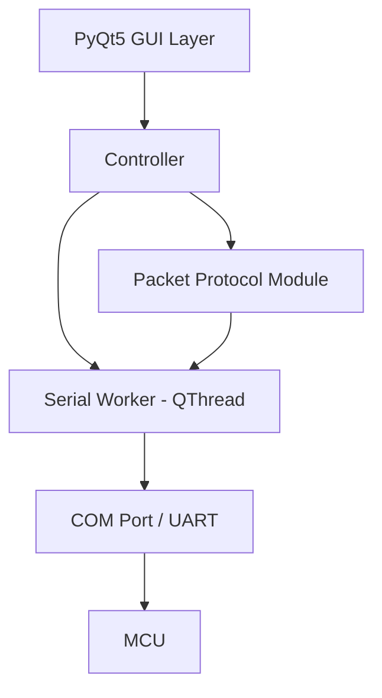

# UART MCU Communication App - Implementation Plan

Xây dựng ứng dụng desktop trên Windows bằng **Python + PyQt5** để giao tiếp với MCU thông qua UART (COM port). App gửi/nhận các gói tin hex theo protocol quy định, hiển thị trạng thái thiết bị và log message.

## Tech Stack

| Thành phần | Công nghệ | Lý do |
|---|---|---|
| Language | Python 3.10+ | User quen thuộc |
| GUI Framework | PyQt5 | Mature, feature-rich, user preference |
| Serial | `pyserial` | Thư viện chuẩn cho UART/COM |
| CRC | Tự implement hoặc `crcmod` | Tính CRC cho packet |

## Architecture



- **GUI Layer**: PyQt5 widgets - buttons, indicators, hex log
- **Controller**: Xử lý logic giữa UI và serial
- **Packet Protocol**: Encode/decode packets (header, payload, CRC)
- **Serial Worker**: QThread chạy background để nhận data liên tục từ MCU

## Project Structure

```
d:\coffee_machine\
├── main.py                 # Entry point
├── requirements.txt        # Dependencies
├── serial_worker.py        # QThread serial read/write
├── packet_protocol.py      # Packet encode/decode, CRC
├── main_window.py          # PyQt5 main window UI
└── resources/
    └── style.qss           # Qt stylesheet
```

## Proposed Changes

### Serial Worker Module

#### [NEW] [serial_worker.py](file:///d:/coffee_machine/serial_worker.py)

- Class `SerialWorker(QThread)`:
  - Mở/đóng COM port với cấu hình (baudrate, data bits, stop bits, parity)
  - Vòng lặp `run()` liên tục đọc data từ serial port, emit signal `data_received(bytes)` khi nhận được packet hoàn chỉnh
  - Method `send(bytes)` để gửi data qua serial
  - Buffer nội bộ để accumulate bytes cho đến khi nhận đủ 1 packet (dựa vào header byte)
  - Signal `error_occurred(str)` khi có lỗi serial

---

### Packet Protocol Module

#### [NEW] [packet_protocol.py](file:///d:/coffee_machine/packet_protocol.py)

- Định nghĩa packet format:

  ```
  [HEADER] [CMD] [DATA_0] ... [DATA_N] [CRC]
  ```

  - `HEADER`: byte cố định đánh dấu đầu packet (ví dụ `0xFF`)
  - `CMD`: command byte
  - `DATA`: payload (độ dài tuỳ theo command)
  - `CRC`: checksum byte cuối

- Class `PacketProtocol`:
  - `encode(cmd, data) -> bytes`: Tạo packet từ command và data, tính CRC
  - `decode(raw_bytes) -> dict`: Parse raw bytes thành `{cmd, data, valid}`
  - `calculate_crc(data) -> int`: Tính CRC (algorithm placeholder, sẽ cập nhật khi có spec cụ thể)

- Định nghĩa các command constants:

  ```python
  CMD_LIGHT_ON = 0x0A
  CMD_LIGHT_STATUS = 0x01
  CMD_WATER_LEVEL = 0x0B
  CMD_TEMPERATURE = 0x0C
  # ... sẽ bổ sung khi có spec
  ```

---

### Main Window UI

#### [NEW] [main_window.py](file:///d:/coffee_machine/main_window.py)

Giao diện gồm 3 khu vực chính:

**1. Connection Panel (top)**

- Dropdown chọn COM port (auto-detect available ports)
- Dropdown chọn baudrate (4800, 9600, 19200, 38400, 57600, 115200)
- Nút Connect/Disconnect
- LED indicator trạng thái kết nối

**2. Control Panel (middle)**

- **Light Control**: Nút "Bật Đèn" + indicator dot (xám → xanh lá khi nhận feedback)
- **Water Level**: SpinBox/Slider nhập mức nước (0-100%) + nút "Gửi"
- **Temperature**: SpinBox nhập nhiệt độ + nút "Gửi"
- Mỗi control có indicator hiển thị giá trị hiện tại từ MCU

**3. Hex Message Log (bottom)**

- QTextEdit read-only hiển thị tất cả packets gửi/nhận
- Format: `[HH:MM:SS] TX >> FF 00 00 0A` và `[HH:MM:SS] RX << FF 00 00 01`
- Nút "Clear Log"
- Auto-scroll xuống dưới

---

### Stylesheet

#### [NEW] [resources/style.qss](file:///d:/coffee_machine/resources/style.qss)

- Dark theme hiện đại
- Styled buttons, indicators, log area
- Color coding: xanh lá cho connected/active, đỏ cho disconnected/error

---

### Entry Point

#### [NEW] [main.py](file:///d:/coffee_machine/main.py)

- Khởi tạo `QApplication`, load stylesheet, show `MainWindow`

---

#### [NEW] [requirements.txt](file:///d:/coffee_machine/requirements.txt)

```
PyQt5>=5.15
pyserial>=3.5
```

## Data Flow

1. **Gửi lệnh** (User → MCU):
   - User click nút → Controller gọi `PacketProtocol.encode()` → `SerialWorker.send()` → UART → MCU
   - Log hiển thị `TX >> FF 00 00 0A`

2. **Nhận feedback** (MCU → User):
   - MCU gửi data → UART → `SerialWorker.run()` đọc bytes → emit `data_received` → Controller gọi `PacketProtocol.decode()` → Cập nhật UI indicator
   - Log hiển thị `RX << FF 00 00 01`

## Verification Plan

### Manual Verification

> [!IMPORTANT]
> Vì app cần COM port thực hoặc virtual COM port, việc test cần hardware hoặc công cụ giả lập.

1. **Chạy app không có COM port**: Mở app, kiểm tra UI hiển thị đúng, dropdown COM port trống hoặc hiển thị available ports
2. **Test với Virtual COM port** (dùng [com0com](https://com0com.sourceforge.net/) hoặc tương tự):
   - Tạo cặp virtual COM port (COM3 ↔ COM4)
   - App connect vào COM3, dùng terminal tool (PuTTY/Realterm) mở COM4
   - Click "Bật Đèn" trên app → kiểm tra hex `FF 00 00 0A` xuất hiện trên terminal
   - Từ terminal gửi `FF 00 00 01` → kiểm tra indicator đèn chuyển xanh trên app
3. **Test log**: Kiểm tra hex log hiển thị đúng timestamp, direction (TX/RX), data

### Automated Tests

- Viết unit test cho `PacketProtocol`:

  ```
  cd d:\coffee_machine
  python -m pytest test_packet_protocol.py -v
  ```

  - Test `encode()` tạo đúng packet bytes
  - Test `decode()` parse đúng packet
  - Test CRC calculation
  - Test invalid packet handling
