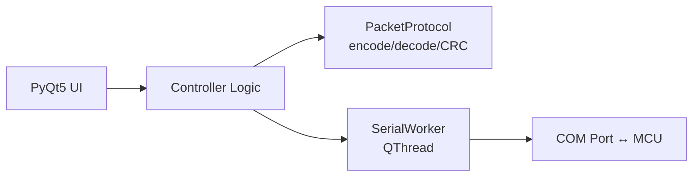

# Walkthrough: Coffee Machine UART Controller App

## Summary

Xây dựng hoàn chỉnh ứng dụng **Python + PyQt5** giao tiếp UART với MCU qua COM port. App có dark theme hiện đại, hỗ trợ gửi/nhận packet hex, hiển thị trạng thái thiết bị real-time.

## Architecture



## Files Created

| File | Mô tả |
|---|---|
| [main.py](file:///d:/coffee_machine/main.py) | Entry point, load stylesheet |
| [main_window.py](file:///d:/coffee_machine/main_window.py) | PyQt5 UI: connection, controls, hex log |
| [serial_worker.py](file:///d:/coffee_machine/serial_worker.py) | QThread serial read/write liên tục |
| [packet_protocol.py](file:///d:/coffee_machine/packet_protocol.py) | Packet encode/decode, CRC, stream parser |
| [resources/style.qss](file:///d:/coffee_machine/resources/style.qss) | Dark theme stylesheet |
| [requirements.txt](file:///d:/coffee_machine/requirements.txt) | PyQt5, pyserial |

## Packet Format

```
[0xFF] [LENGTH] [CMD] [DATA...] [CRC_XOR]
```

| Command | Byte | Hướng | Mô tả |
|---|---|---|---|
| `CMD_LIGHT_ON` | `0x01` | App → MCU | Bật đèn |
| `CMD_LIGHT_OFF` | `0x02` | App → MCU | Tắt đèn |
| `CMD_LIGHT_STATUS` | `0x03` | MCU → App | Phản hồi trạng thái đèn |
| `CMD_SET_WATER_LEVEL` | `0x04` | App → MCU | Gửi mức nước (0-100%) |
| `CMD_WATER_LEVEL_ACK` | `0x05` | MCU → App | Phản hồi mực nước |
| `CMD_SET_TEMPERATURE` | `0x06` | App → MCU | Gửi nhiệt độ (0-100°C) |
| `CMD_TEMPERATURE_ACK` | `0x07` | MCU → App | Phản hồi nhiệt độ |

## Verification Results

### Packet Protocol Tests ✅
```
Light ON packet:        FF 01 01 00
Water level 75%:        FF 02 04 4B 4D
Light status feedback:  FF 02 03 01 00
Stream parser:          2 packets extracted correctly
Invalid CRC detection:  Working
All tests PASSED!
```

### App Launch ✅
- Dependencies installed: PyQt5 5.15.11, pyserial 3.5
- All modules import successfully
- App launches and runs without errors

## How to Run

```bash
cd d:\coffee_machine
python main.py
```

## Testing with Virtual COM Port

1. Install [com0com](https://com0com.sourceforge.net/) hoặc tương tự
2. Tạo cặp virtual ports (COM3 ↔ COM4)
3. Mở app, connect vào COM3
4. Dùng Realterm/PuTTY mở COM4
5. Click **Turn ON** → kiểm tra hex trên terminal
6. Từ terminal gửi `FF 02 03 01 00` → indicator đèn chuyển xanh
